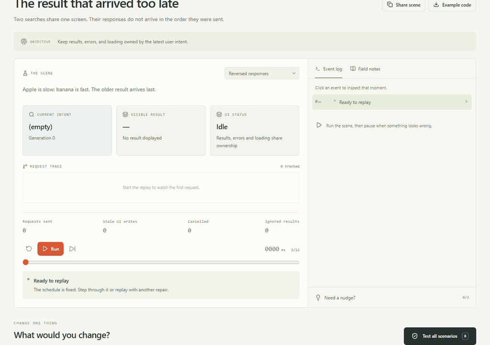

# ReplayFault

[](https://github.com/Goldfish76/replayfault/actions/workflows/ci.yml)

**亲手触发异步故障，重放事件，再验证修复是否成立。**

ReplayFault 是一个开源的浏览器故障实验室，帮助你理解那些取决于事件先后顺序的 bug。逐步查看故障发生过程，在相同场景下比较策略，再分享现场，向同事解释结果。

两个案例 · 每关八个场景、五种策略 · 中英双语

[English](README.md) · [模型说明](docs/models.md) · [参与贡献](CONTRIBUTING.md)

**[打开 ReplayFault，直接试玩 →](https://goldfish76.github.io/replayfault/)**



[查看静态截图](docs/screenshot.png)

## 首版的两个故障

| 案例 | 故障表现 | 重放时检查什么 |
| --- | --- | --- |
| 搜索响应乱序 | 旧工作改变当前结果、错误或加载状态。 | 最新用户意图是否拥有每次界面更新权，并最终得到结果？ |
| 订单重复创建 | 回复丢失、并发重试或重启暴露出重复订单。 | 每次购买能否恢复、只保留一张订单，并拒绝参数不一致的重试？ |

选择一个策略，看看它在这些事件按特定顺序发生时是否仍然有效。

## 怎样使用

1. 选择案例、场景和处理策略。
2. 运行回放，暂停、单步前进，或点击事件检查当时状态。到达终点后，查看每一项检查及其说明。
3. 保持相同场景，比较另一种策略。
4. 点击“检验全部场景”，用本关八个已声明场景检验当前策略。
5. 点击“分享场景”记录当前现场，或点击“下载示例”获取本关的独立教学程序。

同一应用版本中的相同配置会得到相同的模型重放结果。界面展示和验证检查使用同一次模拟的结果，解释对应模型中实际发生的事件。

应用在浏览器本地运行，可以通过静态文件托管。不需要注册账户、填写 API 密钥或运行应用后端。

## 分享现场，或带走代码

分享链接使用带版本的 URL 片段保存案例、场景、策略、回放位置和语言。本地存储只保留语言与已验证案例的进度。

“下载示例”按当前案例下载一个文件：`replayfault-search.mjs` 或 `replayfault-checkout.mjs`。每个文件都是内容固定、无需依赖包的教学程序，包含自己的断言；它与交互引擎分开实现，不导出当前场景配置。下载后，使用 Node.js 运行对应文件：

```sh
node replayfault-search.mjs
node replayfault-checkout.mjs
```

格式和覆盖范围的区别见[分享与下载说明](docs/models.md#sharing-and-downloading)。

## 本地运行

先安装 Node.js 22.12 或更新版本，以及 pnpm（项目固定使用 11.19.0），然后执行：

```sh
git clone https://github.com/Goldfish76/replayfault.git
cd replayfault
pnpm install
pnpm dev
```

打开开发服务器输出的本地地址。

```sh
pnpm test      # 运行单元与模型测试
pnpm build     # 类型检查并构建静态应用
pnpm check     # 一次运行测试和构建
pnpm test:e2e  # 运行浏览器交互测试
```

Windows 本地浏览器测试默认使用已安装的 Microsoft Edge；其他平台和 CI 使用 Playwright 的 Chromium，首次运行前需安装：

```sh
pnpm exec playwright install chromium
```

浏览器测试会自行启动本地开发服务器。可通过 `PLAYWRIGHT_CHANNEL` 选择浏览器通道。例如，在 Windows PowerShell 中使用上述下载的 Chromium：

```powershell
$env:PLAYWRIGHT_CHANNEL = "chromium"
pnpm test:e2e
```

## 验证通过意味着什么

ReplayFault v0.1.0 提供两个经过设计的教学模型。检查通过，表示所选策略在该模型的条件下满足案例断言；它不能验证真实应用的代码、网络、数据库或部署环境。

这里的时钟和事件顺序来自模拟。你可以用它理解机制、复现例子和讨论修复，再到实际环境中验证生产代码。具体假设和限制见[模型说明](docs/models.md)。

## 参与贡献

欢迎提供可复现的反例、更清楚的解释、无障碍改进，或具有明确断言的小型案例。请先阅读 [CONTRIBUTING.md](CONTRIBUTING.md)。新案例需要有具体故障和可检验的解释。

如果希望以后查阅这些例子，或关注新案例，可以收藏这个仓库。

## 来源与许可

案例参考已公开的异步故障模式。[来源与致谢](docs/sources.md)列出了相关的一手资料和同类项目。ReplayFault 的案例是独立实现的教学模型。

[MIT 许可证](LICENSE) © 2026 ReplayFault contributors。
